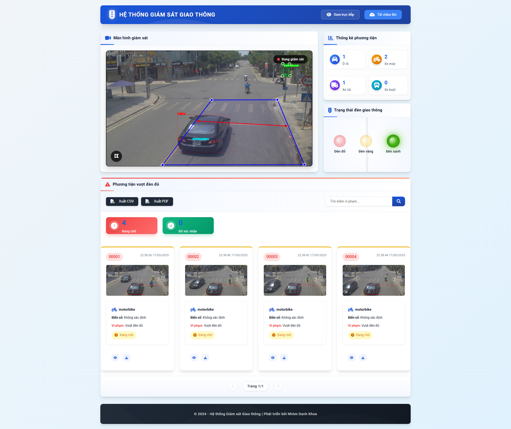
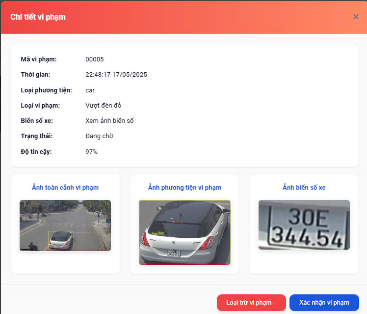
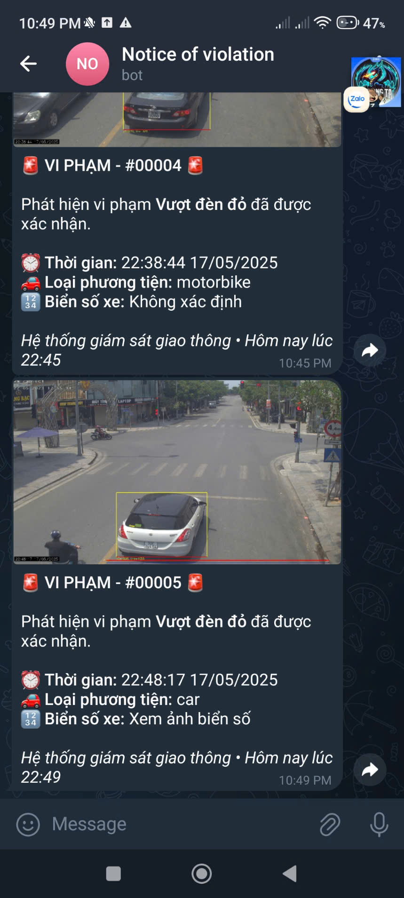
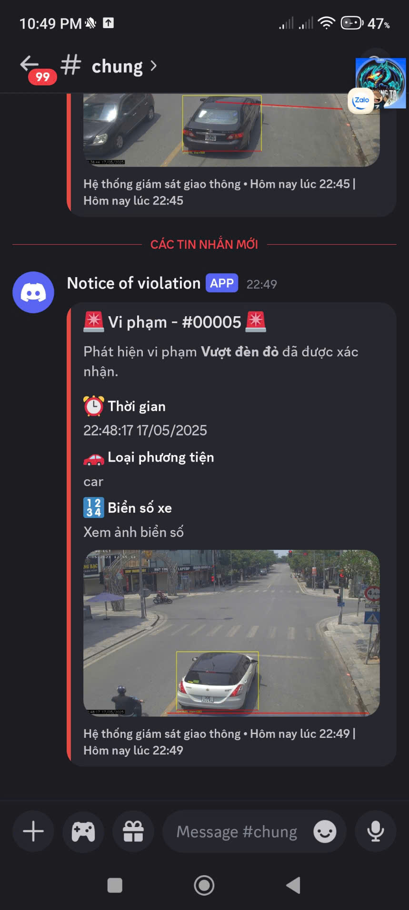

# Hệ Thống Phát Hiện Vi Phạm Đèn Đỏ

Hệ thống giám sát giao thông thông minh với khả năng tự động phát hiện và ghi nhận các trường hợp vi phạm đèn đỏ, sử dụng trí tuệ nhân tạo và xử lý hình ảnh.

## Tính Năng Chính

- Phát hiện và theo dõi phương tiện giao thông
- Nhận diện vi phạm vượt đèn đỏ tự động
- Ghi nhận biển số xe vi phạm
- Gửi thông báo vi phạm qua Discord và Telegram
- Giao diện web trực quan hiển thị dữ liệu vi phạm

## Cài Đặt và Thiết Lập

### Yêu Cầu Hệ Thống

```
Python 3.8+
CUDA (khuyến nghị cho xử lý nhanh)
```

### Cài Đặt Thư Viện

```bash
pip install -r requirements.txt
```

### Cấu Hình

1. Tạo file `.env` tại thư mục gốc của dự án với nội dung:

```
DISCORD_WEBHOOK_URL=your_discord_webhook_url
TELEGRAM_BOT_TOKEN=your_telegram_bot_token
TELEGRAM_CHAT_ID=your_chat_id
SERVER_URL=http://localhost:5000
```

## Sử Dụng

Khởi chạy ứng dụng bằng lệnh:

```bash
python src/run.py
```

Truy cập vào `http://localhost:5000` để sử dụng giao diện web.

## Giao Diện

### Trang Chủ



### Chi Tiết Vi Phạm



### Thông Báo Telegram



### Thông Báo Discord


